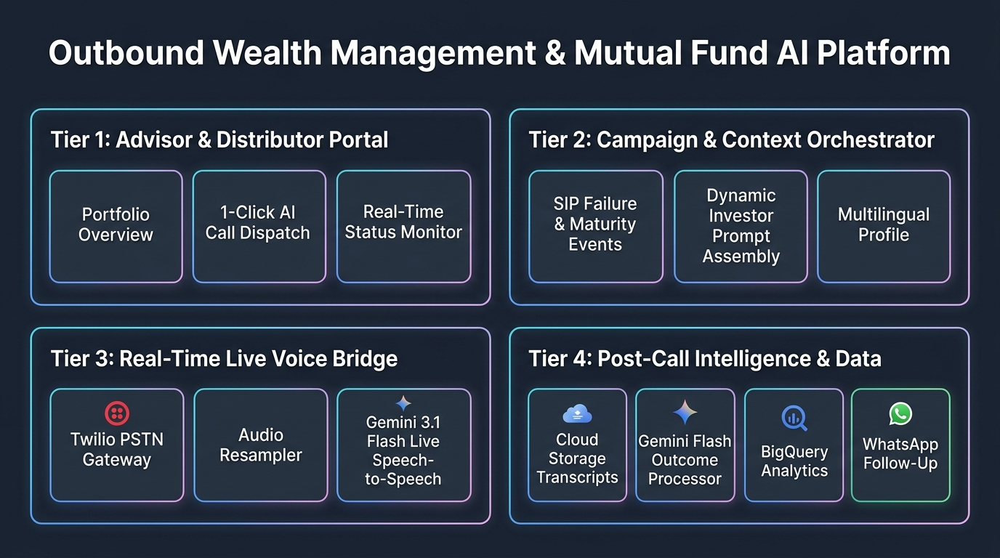
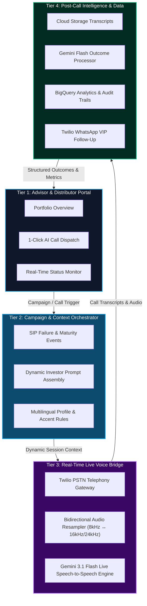

# 📈 Autonomous Wealth Management & Mutual Fund Advisor Platform

[](https://cloud.google.com/vertex-ai)
[](https://deepmind.google/technologies/gemini/)
[](https://cloud.google.com/bigquery)
[](https://cloud.google.com/run)
[](LICENSE)

An enterprise-grade, agentic AI platform designed for Mutual Fund Asset Management Companies (AMCs), Wealth Advisors, and Relationship Managers. Powered by **Gemini 3.1 Flash Live on Vertex AI**, **Google BigQuery**, **Twilio Voice/WhatsApp**, and real-time avatar video streaming.

---

## 🌟 Executive Summary

The platform automates the end-to-end investor advisory and distribution lifecycle:
1. **Trigger Engine**: Monitors real-time portfolio events (e.g. SIP installment failures, dividend payouts, fund maturity, market volatility dips, and pre-approved top-ups).
2. **SEBI & Regulatory Compliance Gate**: Dynamically evaluates risk suitability, mandatory disclaimers, and investor opt-in status before any outreach is initiated.
3. **LiveAPI Voice & Avatar Broker**: Conducts real-time, bilingual (English & Hindi) voice consultations with natural prosody, zero-latency barge-in interruption, and CRM tool execution.
4. **Outcome Processor & Analytics**: Transcribes audio, performs post-call sentiment and intent analysis, logs audit trails into BigQuery, and dispatches WhatsApp statements instantly.
5. **Advisor Command Portal**: A real-time executive dashboard for distributors (ARNs) and Relationship Managers to monitor live call metrics, portfolio distributions, and investor sentiment.

---

## 🏛️ High-Level System Architecture





---

## 📋 Key Modules & Features

| Module | Location | Description |
| :--- | :--- | :--- |
| **Trigger Engine** | [`trigger_engine/`](trigger_engine/) | Detects portfolio milestones, SIP re-engagement opportunities, and fund rebalancing triggers. |
| **Compliance Gate** | [`compliance_gate/`](compliance_gate/) | Enforces mandatory SEBI risk disclosures, investor risk categorization, and communication consent. |
| **LiveAPI Broker** | [`voice/`](voice/) | Microservice managing WebSockets, 16kHz PCM audio streaming, and bidirectional Gemini 3.1 Flash Live communication. |
| **Advisor Dashboard** | [`dashboard/`](dashboard/) | Web interface featuring real-time ARN portfolio analytics, manual call triggers, and interactive video consultations. |
| **Outcome Processor** | [`outcome_processor/`](outcome_processor/) | Post-call pipeline generating structured summaries, intent classification, and instant WhatsApp dispatch. |

---

## 🚀 Quick Start

### Prerequisites
* Python 3.11+
* Google Cloud Project with Vertex AI, BigQuery, and Cloud Storage APIs enabled
* Google Cloud CLI (`gcloud`) authenticated via `gcloud auth application-default login`
* Twilio Account with Voice & WhatsApp sandbox credentials (optional for telephony)

---

### 1. Local Environment Setup

1. **Clone the repository:**
   ```bash
   git clone https://github.com/niteshwalia0124/wealth-mgmt-platform-public.git
   cd wealth-mgmt-platform-public
   ```

2. **Configure environment variables:**
   ```bash
   cp .env.example .env
   ```
   Edit `.env` with your project details:
   ```ini
   GCP_PROJECT=your-gcp-project-id
   GCP_REGION=us-central1
   BQ_DATASET=wealth_mgmt_demo
   GEMINI_LIVE_MODEL=gemini-3.1-flash-live-preview-04-2026
   TWILIO_ACCOUNT_SID=your-twilio-account-sid
   TWILIO_AUTH_TOKEN=your-twilio-auth-token
   ```

3. **Install dependencies:**
   ```bash
   python -m venv .venv
   source .venv/bin/activate
   pip install -r requirements.txt
   ```

4. **Initialize BigQuery dataset and seed demo data:**
   ```bash
   python data/seed_data.py
   ```

5. **Start local services:**
   ```bash
   # Terminal 1: Start LiveAPI Broker
   uvicorn voice.liveapi_broker:app --host 0.0.0.0 --port 8010 --reload

   # Terminal 2: Start Advisor Dashboard
   uvicorn dashboard.server:app --host 0.0.0.0 --port 8080 --reload
   ```
   Open **`http://localhost:8080/advisor`** in your browser.

---

### 2. Cloud Run Production Deployment

Deploy the entire platform to Google Cloud with a single command:

```bash
chmod +x scripts/deploy_gcp.sh
./scripts/deploy_gcp.sh
```

The script automatically:
* Enables Vertex AI, BigQuery, GCS, and Cloud Run APIs
* Provisions BigQuery tables from `data/schema.sql`
* Creates required GCS buckets for audio recordings and transcripts
* Builds and deploys the **LiveAPI Broker** and **Advisor Dashboard** container images to Cloud Run

---

## 🔒 Security & Best Practices

* **No Hardcoded Secrets**: All authentication uses Application Default Credentials (ADC) on GCP or environment variables.
* **SEBI & IRDAI Compliance**: Pre-call suitability filters prevent unsolicited investment advice.
* **Audit Trails**: Every audio turn, tool invocation, and decision payload is logged into BigQuery with immutable timestamps.

---

## 📄 License
This project is licensed under the Apache 2.0 License - see the [LICENSE](LICENSE) file for details.
